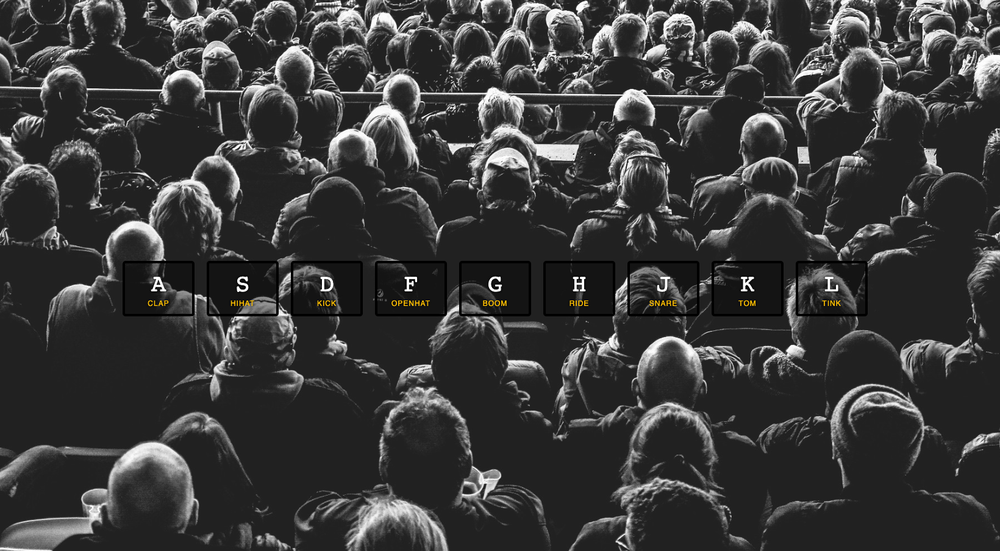

# Js challenge day 1 - JavaScript Drum Kit
In this challenge, I have learnt to create a keyboard responsive drum kit with vanilla JavaScript.
Compose your own beats by pressing one of the selected key down and a sound should play out, enjoy!

